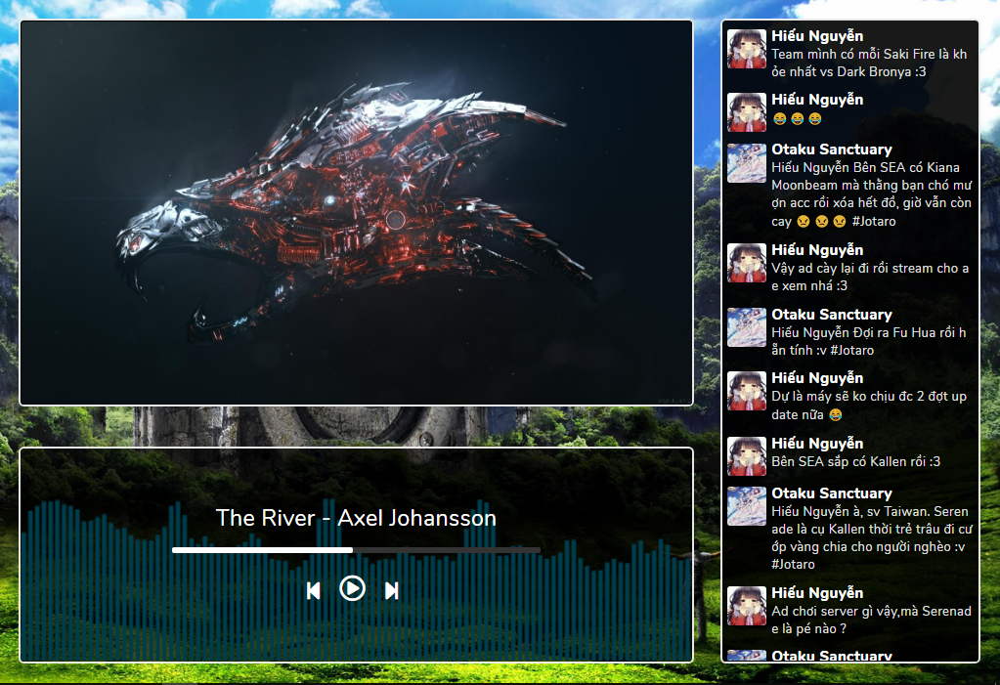

<h1 align="center">
   
  
   
  Fb Live video
   
</h1>

<h4 align="center">
  first app with Vuejs
</h4>

 
 

 
 

## Prerequisite

1. It is required to have NodeJs

2. If you do not have installed node.js in your machine then go to [this link](https://nodejs.org/en/download/) in order to install node.

## How to use

1. Clone this repository.

2. Put your images and musics into the `public/assets/images/` / `public/assets/musics/` directory.

3. Add `ID_POST` and `ACCESS_TOKEN` in the file `config.js` \(You can change the time interval if you want\).

4. Run `npm install`.

5. Run `npm run serve`.